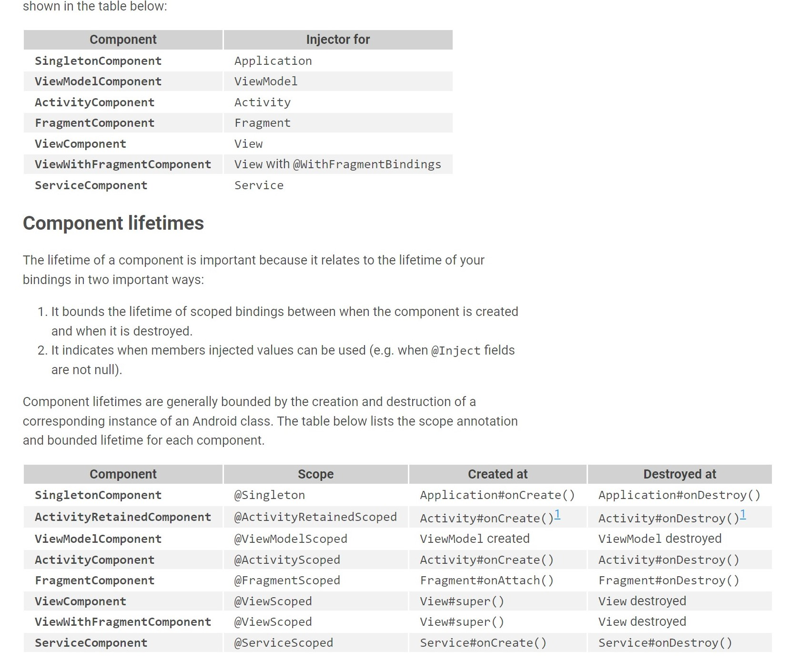

# HILT

Primero Instalamos las dependencias requeridas:

https://dagger.dev/hilt/gradle-setup


En el gradle a nivel app, agregamos lo siguiente:

```java
buildscript {
    repositories {
        google()
        mavenCentral()
    }
    dependencies {
        classpath "com.android.tools.build:gradle:7.0.4"
        classpath "org.jetbrains.kotlin:kotlin-gradle-plugin:1.6.10"
        classpath "com.google.dagger:hilt-android-gradle-plugin:2.40.5"

        
        
    }
}

task clean(type: Delete) {
    delete rootProject.buildDir
}
```

Luego agremos a nivel módulo lo siguiente:

```gradle
android {
    compileSdk 31

    apply plugin: 'kotlin-kapt'
    apply plugin: 'dagger.hilt.android.plugin'

    buildFeatures{
        viewBinding true
    }


    //....
dependencies {
  implementation 'com.google.dagger:hilt-android:2.40.5'
  kapt 'com.google.dagger:hilt-compiler:2.40.5'

  // For instrumentation tests
  androidTestImplementation  'com.google.dagger:hilt-android-testing:2.40.5'
  kaptAndroidTest 'com.google.dagger:hilt-compiler:2.40.5'

  // For local unit tests
  testImplementation 'com.google.dagger:hilt-android-testing:2.40.5'
  kaptTest 'com.google.dagger:hilt-compiler:2.40.5'
}

kapt {
 correctErrorTypes true
}
```


## Aplicación Base (@HiltAndroidApp)
Como siempre agregamos un nueva clase que here de App:
```kotlin

import android.app.Application
import dagger.hilt.android.HiltAndroidApp

@HiltAndroidApp
class BookApp : Application() {
}
```

Lo primero que hay que remarcar es que le agregamos la anotación **``@HiltAndroidApp``**:
> All apps using Hilt must contain an Application class annotated with @HiltAndroidApp. @HiltAndroidApp kicks off the code generation of the Hilt components and also generates a base class for your application that uses those generated components. Because the code generation needs access to all of your modules, the target that compiles your Application class also needs to have all of your Dagger modules in its transitive dependencies.`

Lo segundo, es que debemos agregrar la app al manifest.

## Android Entry Points

Hilt precisa un punto de entrada donde eventualmente injectará los diferentesw módulos que creemos. Los puntos de entrada son los siguientes:

1. Activity
2. Fragment
3. View
4. Service
5. BroadcastReceiver

En una activity:
```kotlin
@AndroidEntryPoint
class MainActivity : AppCompatActivity() {
    override fun onCreate(savedInstanceState: Bundle?) {
        super.onCreate(savedInstanceState)
        setContentView(R.layout.activity_main)
    }
}
```
 En un Fragment:


 ```kotlin
@AndroidEntryPoint
class HomeFragment : Fragment() {

    private lateinit var binding: FragmentHomeBinding

    private val viewModel by activityViewModels<BookViewModel>()


    override fun onCreate(savedInstanceState: Bundle?) {
        super.onCreate(savedInstanceState)

    }

    override fun onCreateView(
        inflater: LayoutInflater, container: ViewGroup?,
        savedInstanceState: Bundle?
    ): View? {
        binding = FragmentHomeBinding.inflate(layoutInflater, container, false)


        return binding.root
    }


}
}
```

## Módulos

Hilt provee una serie de componentes con su Scope que son integrados automátoicamente en los ciclos de vida de una App. Como se observa en el siguiente gráfico, cada anotación tiene sociado un ciclodevida y todos sus hiejos tendran acceso a los bindings de sus ancestros:




Como podemos observar el componente de Singleton,es aquel que estará atado al ciclo de vida de la applicación como también, sus componentes podrán ser accedidos por cualquiera de sus hijos, ya sea un fragment o una activity o un viewmodel. 
Los módulos requiere la anotación de **``@InstallIn``**, instalando un módulo a un componente permite que el binding pueda ser accedido como una depenendencia en aqullos componentes asociados como también en los componentes hijos(ver gráfico anterior.). A su vez pueden ser accedidos vía los puntos de entrada definidas como ``@AndroidEntryPoint``.
Se especifica cual componente de Hilt será instalado  en el módulo poniendo como argumento en la anotación de ``@InstallIn``. Por ejemplo, si quisieramos que el módulo pueda ser usado en toda la applicación, usariamos el *``@SingletonComponent::class``*.

```kotlin
@Module //==> Especificamos el Módulo
@InstallIn(SingletonComponent::class) //==> Donde queremos instalarlo.
object DataModule {...}
```

Con esta breve introducción, podemos definir un objeto de la siguiente forma:

```kotlin

@Module
@InstallIn(SingletonComponent::class)
object DataModule {


    @Singleton
    @Provides
    fun providesRetrofit(): ApiService{
        return Retrofit.Builder()
            .baseUrl("https://my-json-server.typicode.com/Himuravidal/anchorBooks/")
            .addConverterFactory(GsonConverterFactory.create())
            .build()
            .create(ApiService::class.java)
    }

    @Singleton
    @Provides
    fun providesBookDB(@ApplicationContext context: Context) =
         databaseBuilder(context, BooksDatabase::class.java, "books.db").build()


    @Singleton
    @Provides
    fun providesBookDao(db:BooksDatabase) = db.dao()


    @Singleton
    @Provides
    fun provideRepositorio(apiService: ApiService, dao: BookDao) = Repositorio(apiService, dao)


}

```

Como se puede observar, definimos cada uno de los componentes con la anotación ``@Singleton`` y ``@Provides``. Esta ultima permite La función anotada le proporciona a Hilt la siguiente información:

1. El tipo de datos que se muestra le indica a Hilt las instancias de qué tipo proporciona la función.
2. Los parámetros de la función le indican a Hilt cuáles son las dependencias del tipo correspondiente.
3. El cuerpo de la función le indica a Hilt cómo proporcionar una instancia del tipo correspondiente. Hilt ejecuta el cuerpo de la función cada vez que necesita proporcionar una instancia de ese tipo.


Por convención a las funciones que proveen se las denomina provides...Entonces, en el ejemplo anterior vemos que proveemos, el cliente de RetroFit, la base de datos, el dao y por último el repositorio. Para que no se me olvide, se crea la base de datos de la siguiente manera:

```kotlin
@Database(entities = [Books::class, BookDetail::class], version = 1, exportSchema = false)
abstract class BooksDatabase: RoomDatabase() {
    abstract fun dao(): BookDao
}
```

## Injección en los constructores:

En aquellos componentes que definimos en el módulo, y queremos injectarlos en sus respectivas clases, debemos hacerlo con la anotación **``@Inject``**:
```kotlin
class Repositorio @Inject constructor(
    private val api: ApiService,
    private val dao: BookDao
) {
    suspend fun fetchBooksApi() = api.fetchBooksListApi()

    suspend fun insertBooksDB(){
        val listadoLibros = fetchBooksApi()
        dao.insertBooks(listadoLibros)
    }
}
```

## ViewModel
Lo importante aquí es realizar la anotación de **``@HiltViewModel``**:
```kotlin
@HiltViewModel
class BookViewModel @Inject constructor(private val repo : Repositorio) : ViewModel(){
    val listadoApi = MutableLiveData<List<Books>>()

    init {
        viewModelScope.launch(IO){
            listadoApi.postValue(repo.fetchBooksApi())
            repo.insertBooksDB()
        }
    }
}
```

# Activity/Fragment

Para finalizar, suamos la delegación de propiedades con **by**, y dependiendo si es una actividad usamos
- Actividad: 

  ```kotlin 
  private val viewModel by viewModels<BookViewModel>() 
  ```
- Fragmento: 

  ```kotlin 
  private val viewModel by activityViewModels<BookViewModel>()
  ```

Quedaría así en nuestra actividad:

```kotlin
@AndroidEntryPoint
class MainActivity : AppCompatActivity() {
      private val viewModel by viewModels<BookViewModel>()
    override fun onCreate(savedInstanceState: Bundle?) {
        super.onCreate(savedInstanceState)
        setContentView(R.layout.activity_main)
    }
}
```
 En un Fragment:


 ```kotlin
@AndroidEntryPoint
class HomeFragment : Fragment() {

    private lateinit var binding: FragmentHomeBinding

    private val viewModel by activityViewModels<BookViewModel>()

    override fun onCreateView(
        inflater: LayoutInflater, container: ViewGroup?,
        savedInstanceState: Bundle?
    ): View? {
        binding = FragmentHomeBinding.inflate(layoutInflater, container, false)


        return binding.root
    }


}

```