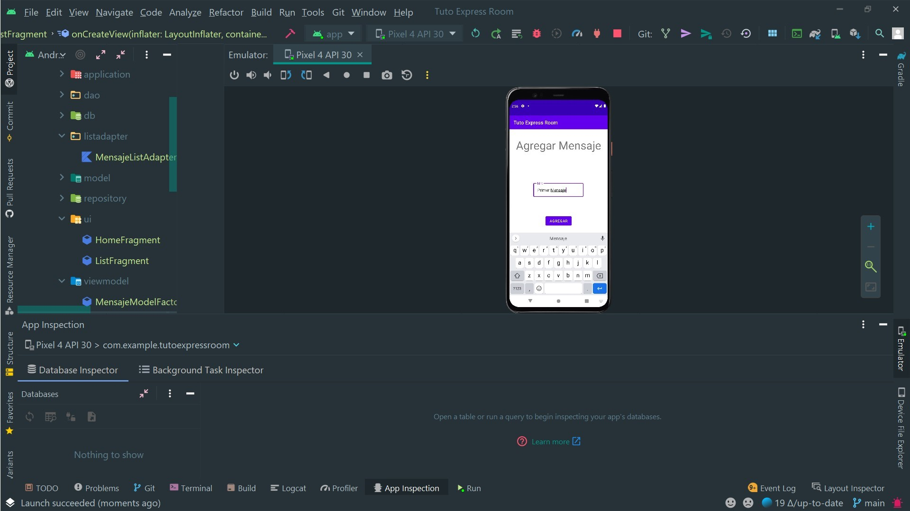
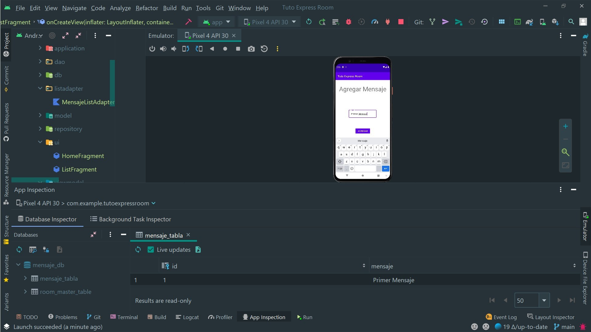
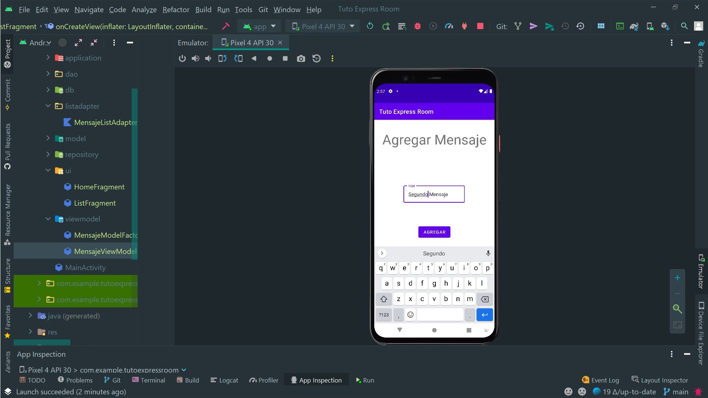
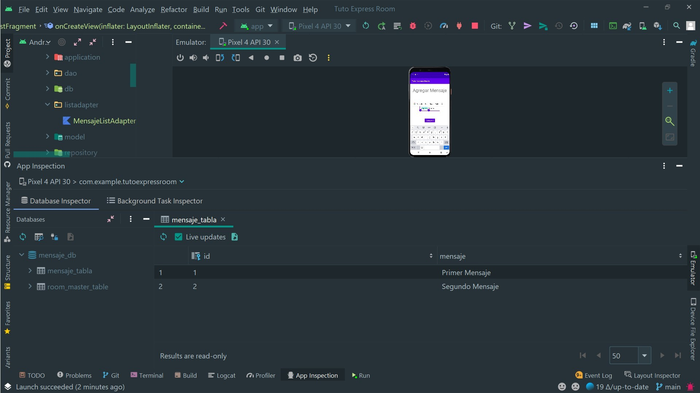
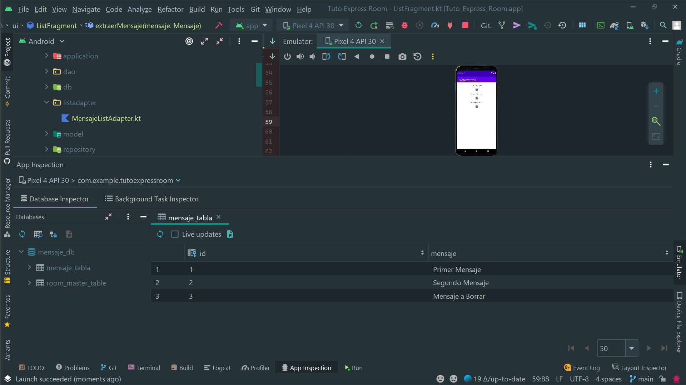
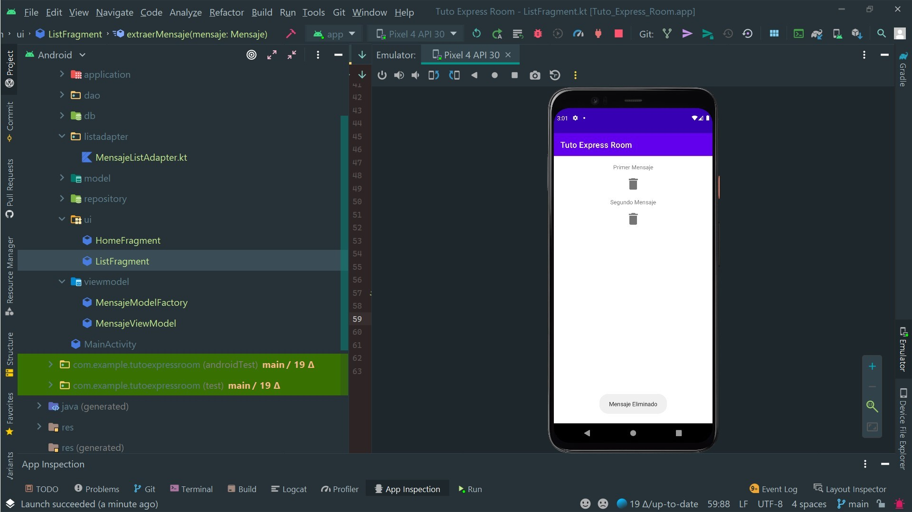

# Room Database

## 1 - Gradle

Agrueguemos las librerías necesarias:
https://developer.android.com/jetpack/androidx/releases/room

```Gradle
android {
    apply plugin: 'kotlin-kapt'
    //....
    
    }

dependencies {
    //LifeCycle
    def lifecycle_version = "2.4.0"


    // ViewModel
    implementation "androidx.lifecycle:lifecycle-viewmodel-ktx:$lifecycle_version"

    // LiveData
    implementation "androidx.lifecycle:lifecycle-livedata-ktx:$lifecycle_version"
    implementation "androidx.lifecycle:lifecycle-common-java8:$lifecycle_version"

    def room_version = "2.3.0"

    implementation "androidx.room:room-ktx:$room_version"
    implementation "androidx.room:room-runtime:$room_version"
    kapt "androidx.room:room-compiler:$room_version"
}

```

>**Importante: Recordar de usar el JDK 11, eso se puede cambiar en el icono del gradle**

## 2 - Modelo
Creamos un modelo con la anotación ```@Entity```. 
**Un consejo, si la llave primaria es de tipo int,podemos ponerle que se autogenere y darle un valor por defecto. Room se encargará de asignarle el valor al id**

```kotlin
@Entity(tableName = "mensaje_tabla")
data class Mensaje(
    @PrimaryKey(autoGenerate = true)
    val id : Int = 0,
    val mensaje: String
    
)
```

## 3 - Dao
Creamos una interfaz con la anotación ```@Dao```, la cual representa las acciones que se haran sobre la Base de Datos. Estás tendrán anotaciones como:
1. ```@Insert```: Aquí podemos seleccionar la estrategia con respecto al conflicto al ingresar nuevos datos. Las opciones más usadas son:
    1. ```@Insert(onConflict = OnConflictStrategy.REPLACE)```
    2. ```@Insert(onConflict = OnConflictStrategy.IGNORE)```


2. ```@Delete```
3. ```@Query```

Hay que tener en claro que debemos usar LiveData/Flow para las query de selección, y esta no requiere que las funciones sean de tipo suspend por que LiveData lo implementa de forma nativa.

```kotlin
@Dao
interface MensajeDao {

    @Insert(onConflict = OnConflictStrategy.REPLACE)
    suspend fun agregarMensaje(mensaje: Mensaje)

    @Delete
    suspend fun borrarMensaje(mensaje: Mensaje)

    @Query("SELECT * FROM mensaje_tabla")
    fun listadoMensajes(): Flow<List<Mensaje>>
}
```

## 4 - Base De Datos

La base de datos requiere la anotación ```@Database```:
```kotlin
@Database(entities = [Mensaje::class], version = 1, exportSchema = false)
//         ↑ 1.
//                                      ↑ 2.
//                                                      ↑ 3.

```
Como argumentos requiere:
1. Un listado con los modelos/entidades que conformarán la base de datos.
2. La versión, por si hay cambios en la estructura de la DB.
3. La opción de exportar el esquema


Nuestra Base de Datos hereda de ``RoomDatabase()``, por lo cual debe ser ``abstract class``.
A su vez tenemos que delcarar una función que representa nuestro DAO, y también debe ser abstracta ``asbtract fun dao(): MensajeDao``.
Por ultimo y no menos importante, creamos un patrón de tipo singleton estático con ``companion object``. representamos una instancia de nuestra db con la anotación ``@Volatile``. Esta se refiere que va a ser accesible imediatamente por otros [threads](https://kotlinlang.org/api/latest/jvm/stdlib/kotlin.jvm/-volatile/). Esta parte es un poco compleja de entender:

```kotlin
        fun getDataBase(context: Context): BaseDeDatos {

            return INSTANCE ?: synchronized(this) {
                val instance = Room.databaseBuilder(
                    context.applicationContext,
                    BaseDeDatos::class.java,
                    "mensaje_db"
                )
                    .build()
                INSTANCE = instance

                instance
            }
        }
```

>**Basicamente dice: Si la instancia es nula crear la baase de datos con ``Room.databaseBuilder...``. Si la db existe, entonces devolver la instancia existente. En terminos de programación:**
```kotlin
    if(db == null){
        //crear base de datos
        return db creada
    }else{
        // devolver la db existente
        return instanciaExistente
    }
```
> *Observación: La base de datos requiere un contexto, una clase de DB, y el nombre de la db.*


```kotlin
@Database(entities = [Mensaje::class], version = 1, exportSchema = false)
abstract class BaseDeDatos : RoomDatabase() {
    abstract fun dao() : MensajeDao

    companion object {

        @Volatile
        private var INSTANCE: BaseDeDatos? = null

        fun getDataBase(context: Context): BaseDeDatos {

            return INSTANCE ?: synchronized(this) {
                val instance = Room.databaseBuilder(
                    context.applicationContext,
                    BaseDeDatos::class.java,
                    "mensaje_db"
                )
                    .build()
                INSTANCE = instance

                instance
            }
        }
    }
}

```

## 4 - Repositorio

El Repo requiere como argumento ``private val dao: MensajeDao``. De aquí podremos hacer las consultas a la base de datos que serán requeridas por el *ViewModel*

```kotlin
class Repositorio(private val dao: MensajeDao) {

    suspend fun agregarMensaje(mensaje: Mensaje) = dao.agregarMensaje(mensaje)

    suspend fun borrarMensaje(mensaje: Mensaje) = dao.borrarMensaje(mensaje)

    fun listadoMensaje(): Flow<List<Mensaje>> = dao.listadoMensajes()
}
```

## 5 - ViewModel

El ViewModel hereda de ``androidx.lifecycle.ViewModel`` y tiene como argumento el repositorio que hemos creado antes ``private val repositorio: Repositorio``.
Como se dijo anteriormente cuando trabjamos con LiveData no es necesario declarar una función de tipo *suspend* ya que LiveData lo implementa. Distinto es el caso con agregar o borrar, en estos si debemos delcarar que es una corrutina. Haciendo un breve repaso, recordemos que una corrutina requiere:
1. Scope: Cual es el alcance de la Corrutina
2. Un Contexto, que puede ser declarado en  en el Scope
3. Un Builder, que puede ser launch con su Dispatcher.

Por ende:
```kotlin
         CoroutineScope(context).launch (IO){ 
         // 1. ↑
         //              2.↑        
         //                      3.↑   
        }


```

Como estamos en un ViewModel heredando de ``ViewModel()``, la librería del [lifecycle](https://developer.android.com/topic/libraries/architecture/lifecycle?hl=es), esta nos proporciona con un scope predefinido, con su contexto:
>Se define un ViewModelScope para cada objeto ViewModel de tu app. Si se borra ViewModel, se cancela automáticamente cualquier corrutina iniciada en este alcance. Las corrutinas son útiles cuando tienes trabajos que se deben hacer solo si ViewModel está activo

Por ende:
```kotlin
          viewModelScope.launch(IO) {
         // 1. ↑
         //              2.↑        
         //                      3.↑   
        }


```

```kotlin
class MensajeViewModel(private val repositorio: Repositorio): ViewModel() {    
    
    val listadoMensaje: LiveData<List<Mensaje>> = repositorio.listadoMensaje().asLiveData()
    
    fun agregarMensaje(mensaje: Mensaje){
        viewModelScope.launch { 
            repositorio.agregarMensaje(mensaje)
        }
    }
    
    fun borrarMensaje(mensaje: Mensaje){
        viewModelScope.launch { 
            repositorio.borrarMensaje(mensaje)
        }
        
    }
}
```

**Importante: Recordar que cuando necesitamos instanciar un viewmodel con argumentos tenemos que crear un Factory que nos devuelva el mismo con su argumento, en este caso un repositorio**

```kotlin
class MensajeModelFactory(private val repositorio: Repositorio): ViewModelProvider.Factory {
    override fun <T : ViewModel> create(modelClass: Class<T>): T {
        return MensajeViewModel(repositorio) as T
    }
}

```

## 6 - Injección de Dependencias Manual

Creamos una clase que herede de ``Application()`` , donde instanciaremos nuestra base de datos y nuestro repositorio:

```kotlin
class MensajeApplication : Application() {

    private val database by lazy { BaseDeDatos.getDataBase(this) }
    val repositorio by lazy { Repositorio(database.dao()) }
}
```
**Recordar que hay que agregar al manifest el ``MensajeApplication``**

## 7 - Fragmentos y ViewModel

En el fragmento debemos intanciar el viewmodel y la aplicación. Desde el ``onCreateView`` llamamos al viewmodel y agremaos los datos a la DB.

```kotlin

class HomeFragment : Fragment() {
    private lateinit var binding: FragmentHomeBinding
    private lateinit var application: Application // App

    private val viewModel by viewModels<MensajeViewModel> {
        MensajeModelFactory((application as MensajeApplication).repositorio)
    } // Instanciamos el ViewModel Con su Model Factory y el repositorio desde la clase
    // Application haciendo un casting (application as MensajeApplication).repositorio


    override fun onCreate(savedInstanceState: Bundle?) {
        super.onCreate(savedInstanceState)
        application =  requireActivity().application // Instanciamos la APP

    }

    override fun onCreateView(
        inflater: LayoutInflater, container: ViewGroup?,
        savedInstanceState: Bundle?
    ): View? {
        binding = FragmentHomeBinding.inflate(inflater, container, false)

        val boton = binding.button

        boton.setOnClickListener {
            val et = binding.etmensaje.text.toString()


            val mensaje = Mensaje(mensaje = et)
            viewModel.agregarMensaje(mensaje)

            Toast.makeText(requireContext(), "Mensaje Agregado", Toast.LENGTH_SHORT).show()
        }

        return binding.root
    }


}

```

Si mostramos un listado y queremo borrar un elemento recordar el uso de interfaz para extraer el objeto:
```kotlin
class ListFragment : Fragment(), MensajeListAdapter.MiExtractor {
    private lateinit var binding: FragmentListBinding
    private lateinit var application: Application

    private val viewModel by viewModels<MensajeViewModel> {
        MensajeModelFactory((application as MensajeApplication).repositorio)
    }

    override fun onCreate(savedInstanceState: Bundle?) {
        super.onCreate(savedInstanceState)
        application = requireActivity().application

    }

    override fun onCreateView(
        inflater: LayoutInflater, container: ViewGroup?,
        savedInstanceState: Bundle?
    ): View? {
        binding = FragmentListBinding.inflate(layoutInflater, container, false)

        val recyclerView = binding.recyclerView
        val adapter = MensajeListAdapter(this)
        recyclerView.adapter = adapter
        recyclerView.layoutManager = LinearLayoutManager(requireContext())


        viewModel.listadoMensaje.observe(viewLifecycleOwner, {
            adapter.submitList(it)
        })


        return binding.root

    }

    override fun extraerMensaje(mensaje: Mensaje) {
        viewModel.borrarMensaje(mensaje)
    }


}

```

# Algunas Imágenes







