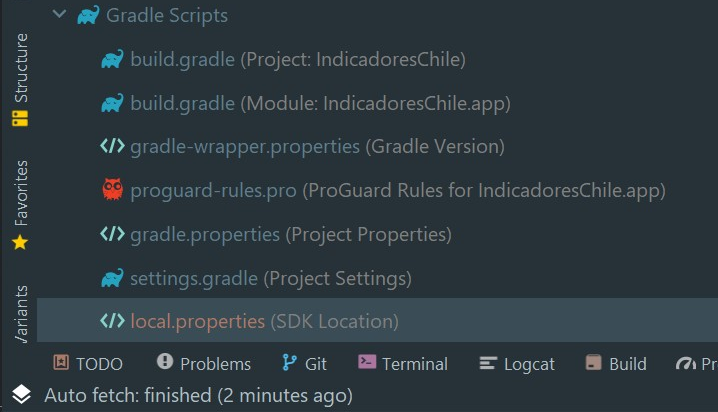
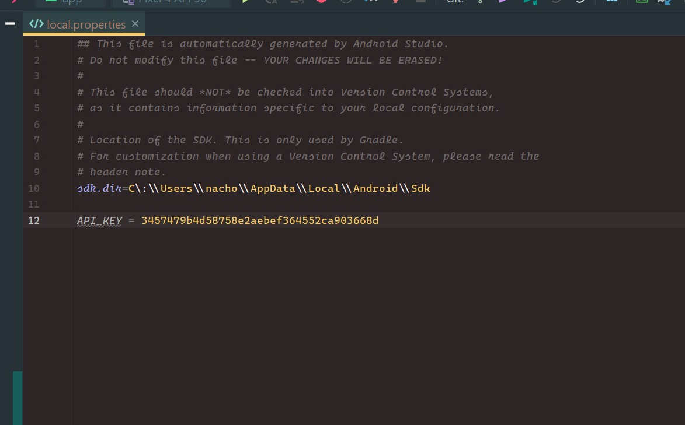
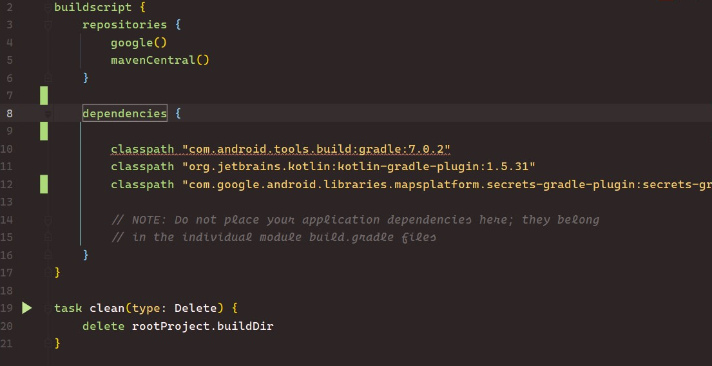
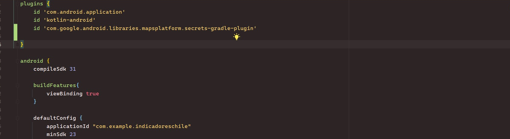
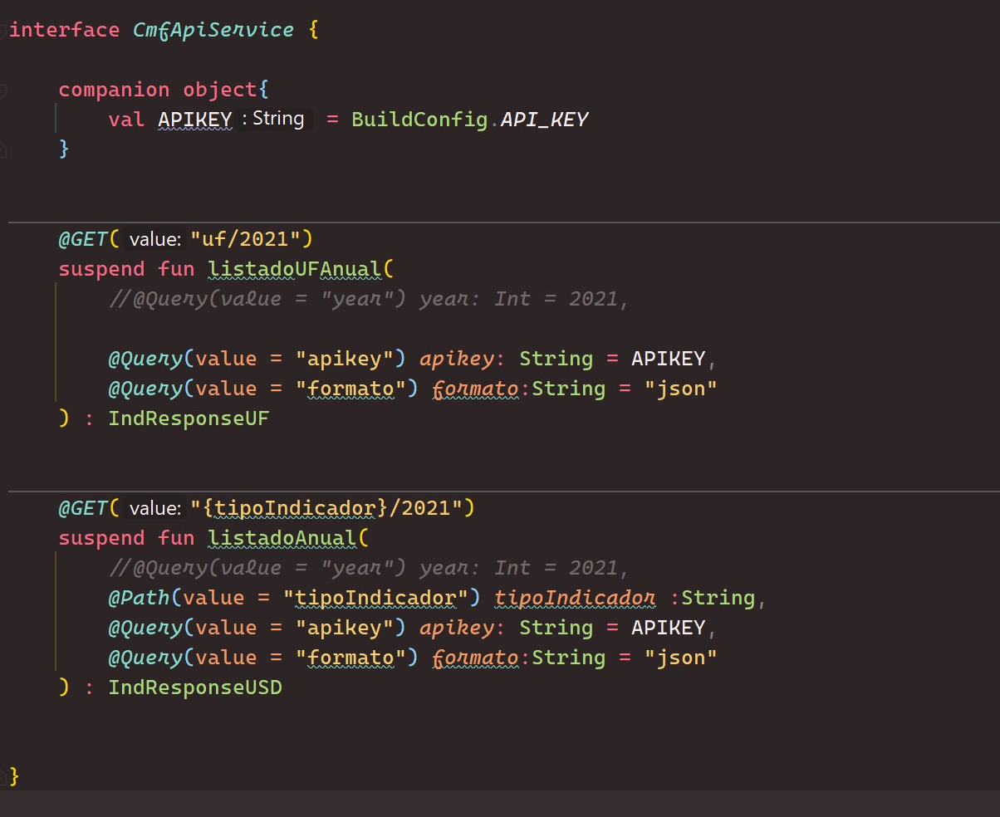

<h1>Guardar API</h1>

## https://github.com/google/secrets-gradle-plugin

## 1 - Guardamos la API KEY

Guardamos la apiKey en gradle/ ``local.properties``



```groovy
## This file is automatically generated by Android Studio.
# Do not modify this file -- YOUR CHANGES WILL BE ERASED!
#
# This file should *NOT* be checked into Version Control Systems,
# as it contains information specific to your local configuration.
#
# Location of the SDK. This is only used by Gradle.
# For customization when using a Version Control System, please read the
# header note.
sdk.dir=C\:\\Users\\nacho\\AppData\\Local\\Android\\Sdk

API_KEY = 5edd886c15e34c9312zf7bf018d589a

```




## 2 - Agregamos en Project Gradle

A nivel projecto en el archivo ``build.gradle`` agregamos el siguiente class path:


```groovy
buildscript {
    dependencies {
        classpath "com.google.android.libraries.mapsplatform.secrets-gradle-plugin:secrets-gradle-plugin:2.0.0"
    }
}
```



## 3 - Agregamos en Module Gradle

A nivel módulo en el archivo ``build.gradle`` agregamos el siguiente id dentro de plugins:

```grovy
plugins {
    id 'com.google.android.libraries.mapsplatform.secrets-gradle-plugin'
}
```




## 4 - Accedemos a la API KEY

Desde la interfaz de Api service creamos un companion  object que nos traiga el API_KEY

```kotlin
interface ApiService {

    companion object{
        val APIKEY = BuildConfig.API_KEY
    }
}
```




Esto se usaba antes

```groovy

plugins {
  id "com.google.secrets_gradle_plugin" version "0.6.1"
}
```